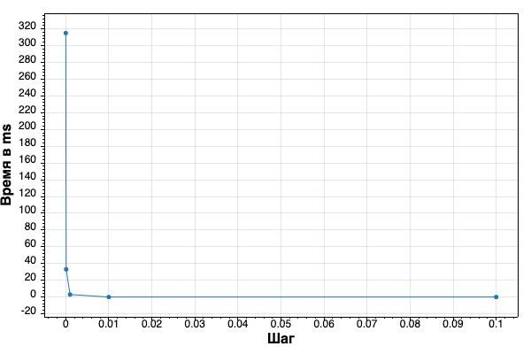
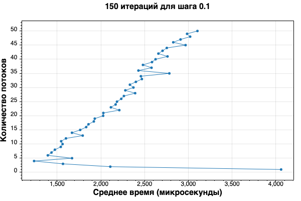

# Отчет
Размер шага: 0.1

Оптимальное количество потоков: 4

Скорость однопоточной версии в среднем: 3340 микросекунд

Скорость версии в 4 потока в среднем: 1240 микросекунд

Версия в 4 потока выигрывает по сравнению с однопоточной версией в среднем на 60%

Результаты с каждым запуском могут отличаться, однако версии многопоточного решения, начиная с 3 потоков и в среднем до 13 потоков выигрывают однопоточную версию на 45-60%.
# Полученные числовые значения для каждого шага (все укладываются в погрешность 1е-4):
1E-05: -7.124882010333539E-15

0.0001: -1.7828959337530537E-15

0.001: -1.4415768925801764E-14

0.01: -5.0948828489438824E-15

0.1: -1.6604773112049998E-14

# График выбора шага для подсчета (сравнение времени работы):

# Вывод для некоторого количества потоков (далее время c возрастанием кол-ва потоков только увеличивается):
Время без потоков (среднее за 150 итераций): 3336.334666666666

Время для 1 потока (среднее за 150 итераций): 4060.4186666666656

Время для 2 потока (среднее за 150 итераций): 2107.5440000000017

Время для 3 потока (среднее за 150 итераций): 1566.5060000000005

Время для 4 потока (среднее за 150 итераций): 1236.3026666666674

Время для 5 потока (среднее за 150 итераций): 1669.9240000000011

Время для 6 потока (среднее за 150 итераций): 1392.9513333333332

Время для 7 потока (среднее за 150 итераций): 1435.1640000000007

Время для 8 потока (среднее за 150 итераций): 1473.8606666666667

Время для 9 потока (среднее за 150 итераций): 1541.4353333333338

Время для 10 потока (среднее за 150 итераций): 1561.917333333334

Время для 11 потока (среднее за 150 итераций): 1545.6573333333333

# График выбора оптимального количества потоков:

